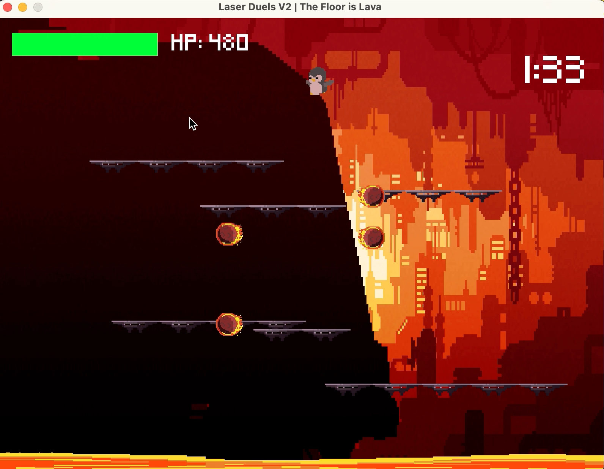
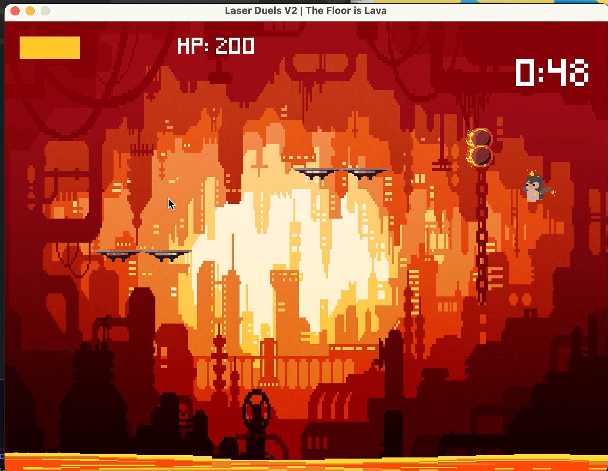
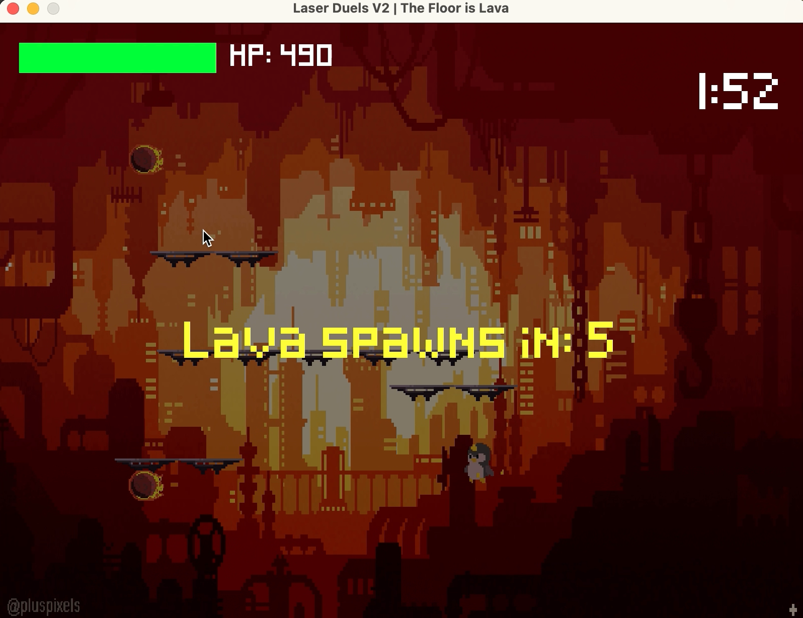
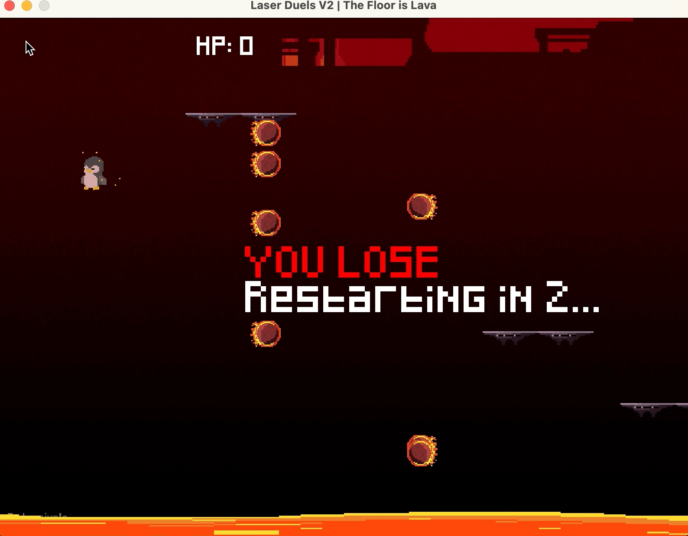

# LaserDuels-2-Java-Game-Single-Player

A fun little recreation of my old LaserDuels project, redesigned and improved for solo play.

---

## Overview

In **LaserDuels-2**, your goal is to **survive for 2 minutes** without losing all your HP. Avoid fireballs and falling into lava to keep your health up 
(you're a penguin here btw)!

- **Background music** uses Cynthia's theme. Happy flashbacks!
- **Gameplay:** The platform size dwindles over time while the number of fireballs increases!

---

## How to Win

- Survive **2 minutes** without your HP dropping to zero.
- Avoid fireballs and lava:
  - **Fireball hit:** -10 HP
  - **Lava hit:** -50 HP
- You can **punch fireballs** by clicking on them within your range to destroy them and prevent damage.

---

## Controls

| Action         | Keys                  |
| ---------------| --------------------- |
| Move Left      | `A` or `Left Arrow`   |
| Move Right     | `D` or `Right Arrow`  |
| Move Up        | `W` or `Up Arrow`     |
| Move Down      | `S` or `Down Arrow`   |
| Jump           | `Spacebar`            |
| Punch Fireball | `Mouse Click`         |

---

## Getting Started


Unzip the file and open your terminal, then navigate to the folder:
1. Download the code from GitHub.
2. Unzip the file and open your terminal, then navigate to the folder:
```
cd ~/LaserDuels-2-Java-Game-Single-Player
```
4. Make sure you have Java Development Kit (JDK) and Java Runtime Environment (JRE) installed.
5. Compile the Java files:
```
javac *.java
```
8. Run the program::
```
java GameFrame
```

---

## How to Play

1. Move around using AWSD or arrow keys.
2. Jump (up to two times) with spacebar to avoid hazards.
3. Click on nearby fireballs to punch and destroy them.
4. Avoid lava at all costs — it deals heavy damage.
5. Survive 2 minutes to win the game!

---

## Game Screenshots

Here are screenshots of the game in action.


---

---

---

---
